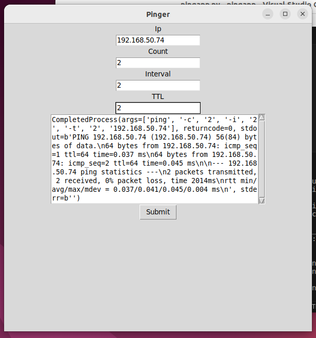

<h1 align="center">Pingapp</h1>


<p align="center">
</p>
<div align="center" id="top"> 
  

  &#xa0;
</div>
<br>

## About ##

Simple cross platform ping python app made with tkinter (GUI) for 

## Requirements/Feaures ##

tkinter \
On Windows you have to be admin \
On linux it doesn't matter


```bash
# Clone this project
$ git clone https://github.com/{{YOUR_GITHUB_USERNAME}}/pingapp

# Access
$ cd pingapp

# Install dependencies
$ install tkinter on linux

```


<a href="#top">Back to top</a>
